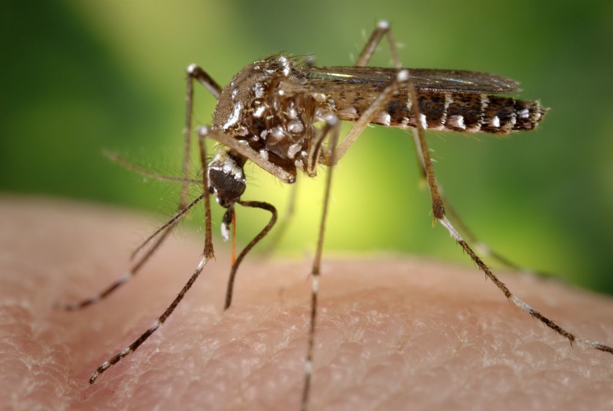

# Predicting Dengue Fever



## Structure
* Data Prep and Exploration: [README.md](./README.md)
* Dengue Fever Machine Learning Predictions: [predictions.md](predictions.md)

## Problem Overview

**Dengue Fever** is also known as breakbone fever and dandy fever It is a single-stranded RNA virus caused by Mosquitoes of the genus Aedes. These mosquitoes are most often found in **urban** areas as they like to harvest in man made products such as tires, flowerpots, and buckets. They were brought into Northern America and Europe by Asian products. It should be noted that they are capable of surviving subfreezing temperatures, allowing them to spread to cooler climates. There are four types of Dengue viruses which results in an acute infectious disease with **symptoms** of a high fever, joint pain, and muscle pain. The first signs of dengue includes fever, headache, joint pain, and rashes.

This disease is spread through the **female mosquito** bite and often occurs in tropical areas. A mosquito becomes infected when it drinks the blood of a person who is already infected with dengue. The mosquito can transmit the virus after one week of being infected. Dengue can’t be spread from person-to-person; however, infected humans can travel and potentially spread dengue to other countries. Other than providing a patient with pain medications and fluid, there is no specific **treatment** for dengue. A dengue vaccine is being developed and one has been approved for use in Mexico and Brazil.

**Goal**: Predict weekly reported dengue fever cases in San Juan, Puerto Rico, and Iquitos Perú based on environmental variables.
The format for the post-analysis submission file is simply the `city, year, weekofyear, total_cases`

**Dengue dataset**: Data collected by U.S. Federal Government agencies
- Centers for Disease Control and Prevention
- DoD Naval Medical Research 
- Armed Forces Health Surveillance Center
- National Oceanic and Atmospheric Administration

**Pertinent variables**:
Dengue fever is known to be related to climate and humidity:
* `station_diur_temp_rng_c` – Diurnal temperature range
* `reanalysis_relative_humidity_percent` – Mean relative humidity


## Data Preparation

We see that lacking values were filled with `NaN`. Initially, we considered dropping all rows that contain any nulls. After some consideration we realized that we would be losing a lot of data if we did so. Our strategy will be to make a temporary data frame for each model we use. Each of these will drop rows with nulls **only** if the variable being used for that row is a null. A nice aspect to mention is that a library that we are using, matplotlib, automatically deals with NaN and None values by dropping it and not visualizing it. Omitting NaN values will help us avoid any dirt data.

We added a new variable `new_avg_temp_c` to the data frame. This value consists of the averages between `station_avg_temp_c` and `reanalysis_avg_temp_k` in order to find a common grounf for temperature between the datasets.


## Data Exploration


### Correlation Interpretation


Above is a bar chart of feature correlations to the total cases of dengue. To determine which variables have the most correlation with total cases, we look for the the highest absolute values. The categories with the highest values are: 

* Reanalysis of minimum air temp
* The Year
* Daytime temperature


### Dengue cases per year


This visualization provides information on Dengue occurencers per year in comparison between Iquitos, Peru and San Juan, Puerto Rico.

It should be noted that there are no Dengue cases in Iquitos reported in our data pre 2000. Yet, according to the [National Institutes of Health](https://www.ncbi.nlm.nih.gov/pubmed/26102121) there were cases of it as early as 1990. It is difficult for us to know how this will affect our analysis but it should be taken into consideration.

The differences in total cases of dengue between the two cities is impressive. We will be furthering explore these differences throughout our report.


### Minimum Air Temperature per City Interpretation


As the minimum air temperature increases, the total cases of degue increases. San Juan, Puerto Rico is on average much warmer than Iquitos, Peru. There are increasingly many more cases of dengue in San Juans than in Iquitos.


### Dengue cases vs daytime temperature range


We observed the change in total dengue cases relative to daytime temperature range. The temperatures that fall in the smaller ranges (fluctuating between two to four degrees Kelvin) are surprisingly at a higher temperature. This could indicate that locations where the daytime temperature range is minimal, temperatures tend to be high and therefore, more cases of dengue fever occur.


### Week of the Year Interpretation


There appears to be a seasonal increase of dengue cases between weeks 35 to 50. There is a dip/decrease of dengue cases between weeks 10 to 20. Though this graph makes it difficult to see when dots overlap, this visualization gives the information that the number of dengue cases changes depending on the season.


## Statistical Modeling

**Chosen Statistical Approach**
We are choosing to use **forward selection** as our statistical approach by using the code provided in [this link](https://planspace.org/20150423-forward_selection_with_statsmodels/) with total Dengue cases as our dependent variable. 


**What is forward selection**
At a high level forward selection is the idea of starting with an empty model and slowly adding on whatever variable will make our model best until a variable make the model worse or until we are out of variables.

In a more detailed explanation,  forward selection is a type of _stepwise regression_ that outputs the best independent variables to use in a model.

It’s construction  begins with a base intercept, we test the potential given independent variables that may be relevant, and add the one that best improves our model. This process is repeated until the variables offered only decreased the r-squared value or until there are no more variables available.


**Why forward selection**
To avoid overfitting, we’ll use forward selection to determine the top variables while allowing us the flexibility of scaling our model past this dataset

Looking at the correlations from our exploratory analysis, we found that multiple variables stood between 0.20 and 0.30 correlation probability in relation to total cases of Dengue. With so many variables at high correlation probabilities we found that forward selection would do a good job of picking up the ones that best support a model. We understand that this method tends to be over fitting. In our situation we would prefer this in comparison to the under fitting backwards selection as we would be basing our aggressive fit on real data. Additionally with the support of our background research we are confident that we could remove variables from the selection output that we believe will negatively impact the mode


## Model Variables

After running the forward selection function with total cases of dengue as the dependent variable, our resulting model looks like:

``` 

total_cases ~ 
week_start_date + station_diur_temp_rng_c + station_avg_temp_c + 
reanalysis_max_air_temp_k + reanalysis_sat_precip_amt_mm + 
reanalysis_precip_amt_kg_per_m2 + reanalysis_specific_humidity_g_per_kg + 
reanalysis_dew_point_temp_k + reanalysis_min_air_temp_k + city + 1 

```


## Variable overview

### Dependent Variable
**total_cases** is the dependent variable that we are trying to predict based off of the independent, environmental variables.

#### **Date**
As seen in our exploratory visualization on the relationship between the week of the year and the total cases of dengue, the total cases fluctuate depending on the week number and thus, the season. With the idea that mosquitoes prefer warmer weather, changes in the **week_start_date** is directly related to changes in the temperature and how mosquitos behave.

#### **Temperature-related variables**
These variables include:
station_diur_temp_rng_c 
station_avg_temp_c 
reanalysis_max_air_temp_k 
reanalysis_min_air_temp_k 

According to our background research on dengue fever, the disease often occurs in tropical areas where it is warm. As the air temperatures and daytime temperatures increases and mosquitoes become more active, the total_cases will increase as well.

#### **Humidity-related variables**

As described in our background research, mosquitoes tend to live and spawn near water. According to the Museum of Climate Controls ([source](http://www.musecc.com/how-are-temperature-and-relative-humidity-related)), temperature and humidity are closely related. Throughout our data exploration and online research we have found that there is a strong relationship between tropical climates and cases of dengue fever. It is no surprise that humidity variables were returns by the forward selection as the greater the temperature the more moisture the air can hold. Tropical climates tend to have higher temperatures and our data exploration so far has shown that high temperatures throughout the day are related to dengue cases.As the humidity and precipitation increases and mosquitoes become more active, the total_cases will increase as well.

These variables include:
reanalysis_sat_precip_amt_mm 
reanalysis_precip_amt_kg_per_m2 
reanalysis_specific_humidity_g_per_kg 
reanalysis_dew_point_temp_k 


#### **Location**
The dataset included two cities  - San Juan, Puerto Rico and Iquitos, Perú. San Juan is surrounded by water and has higher observed temperatures, whereas Iquitos is located relatively more inland. Though Iquitos near a river but with lower observed temperatures. Depending on the geographical location of a **city**, relative to any surrounding bodies of water and temperature, mosquitoes are more likely to thrive in warmer cities near water.


## Interpretation

The set of **variables** that we are including for our model:

``` 
total_cases ~ 
week_start_date + station_diur_temp_rng_c + station_avg_temp_c + 
reanalysis_max_air_temp_k + reanalysis_sat_precip_amt_mm + 
reanalysis_precip_amt_kg_per_m2 + reanalysis_specific_humidity_g_per_kg + 
reanalysis_dew_point_temp_k + reanalysis_min_air_temp_k + 1 

```

We decided to remove the **city** variable.

Our justification for removing the city variable was because when we created visualizations to explore the year column in the dataset, we noticed that San Juan has data from 1990 - 2008, whereas Iquitos only has data from 2002 - 2010. When we removed **city** from the equation, the adjusted R-squared decreased by 0.1%. Since the ratio of data from both locations were disproportionate and Iquitos is missing 12 years of data relative to San Juans, we removed **city** from the equation.


### **Written Results**

Examining our model results and our adjusted r-squared value, we have found that this model explains 85.7% of the variance in this dataset. This particular model has an adjusted r-squared value to accommodate for the multiple variables in the model. The adjusted value will increase if the new variable improves the model more than expected by chance, which also increases the **accuracy** of our model.

All variables, except for the minimum air temperature (reanalysis_min_air_temp_k), were statistically significant where the p-value was less than 0.05. Meaning, there was a 5% probability that we were to observe these trends by chance. Out of all the values in the week_start_date column, 145 values were statistically significant where the p-value was less than 0.05 and therefore, this value was added to the model

Based on our model results we believe that our model has a strong fit.

**Visual Results**

The bar chart below demonstrates beta coefficients for how chosen features. It should be taken into consideration that “reanalysis_min_air_temp_k” was not statistically significant with a P value of 0.3 . 


**Week Start**
Surprisingly, most p values for “week start date” were not statistically significant. Out of the 1047 rows for week_start_date, only 145 rows were statistically significant. With this information, we were encouraged to try running the model with “week_of_day” instead of “week_start_date”. By swapping the variables, this produced an adjusted r-square value of 0.1, greatly decreasing our previous adjusted r-squared value by 75%. Though we do not have a full understanding of how  or why week_start_dates influences our model and week_of_day does not, we understand that it is extremely important for our fit and variance.

Nevertheless, we did find that every few years between the months of September and January, there were extreme spikes in beta coefficients that were in the 90 - 430 range with statistically significant p values. With a bit of research, we can see that [Puerto Rico’s hottest month](https://www.holiday-weather.com/san_juan_/averages/) with increased rain and humidity is typically September. Based on our findings, all of these details coincide with elevated amounts of dengue cases.

Additionally, these findings match with the total cases of dengue mapped across weeks per year.

As you can see, extreme numbers of total cases are found in the weeks at the end of the year.

**Humidity**

* We found that for every unit increase in “mean dew point temperature” (reanalysis_dew_point_temp_k) there was a decrease of 32 cases of dengue.
* Additionally for every unit increase in “mean specific humidity” (reanalysis_specific_humidity_g_per_kg) there was an increase of 34 cases of dengue.

This makes sense for two reasons. One, based on research we previously explained, dengue tends to occur in climates with high humidity. Two, according to a [National Weather Service post](https://www.weather.gov/arx/why_dewpoint_vs_humidity) the lower the dew point temperature threshold the easier it is for it to become humid. This means that our model is explaining that when the dew point increases it becomes harder for it to become humid and therefore there are less cases of dengue. In comparison the lower the dew point, the higher humidity there is as well as higher cases of dengue.

## Citations
* https://www.drivendata.org/competitions/44/dengai-predicting-disease-spread/ 
* https://www.health.ny.gov/diseases/communicable/dengue_fever/fact_sheet.htm 
* http://www.muxetv.com/2019/01/08/medical-centric-what-is-dengue/